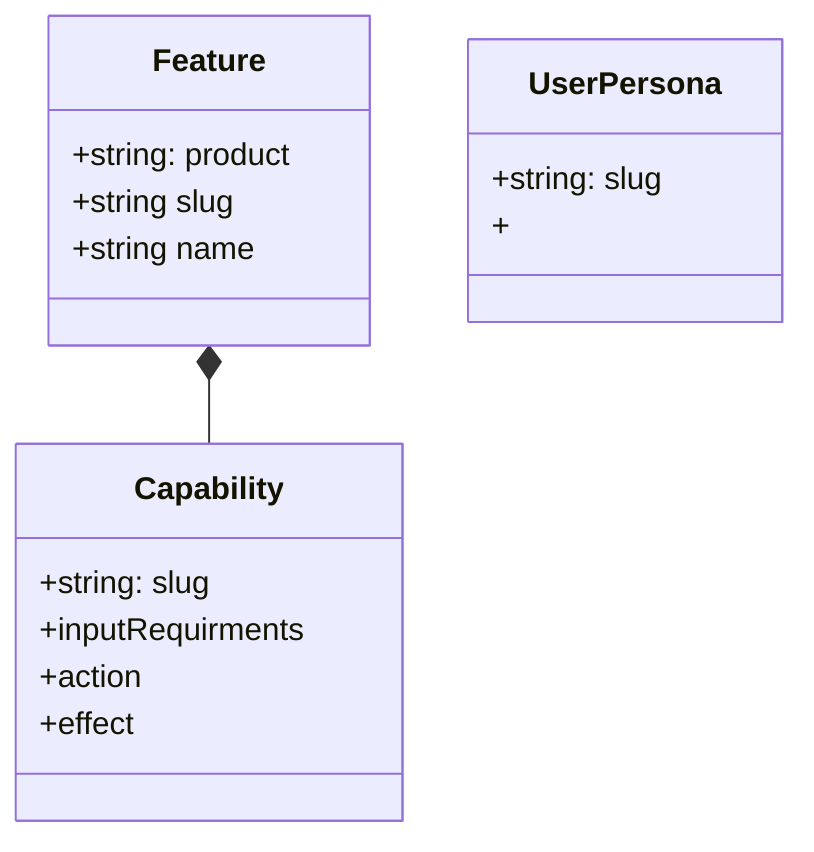

# Architecture Metamodel

## Context

## Metamodel

```mermaid
---
Architecture Metamodel 
---
classDiagram
  
    class Feature{
      +string: product 
      +string slug
      +string name
    
    }

    class Capability{
      +string: slug
      +inputRequirments
      +action
      +effect
    }

    class UserPersona{
      +string: slug
      +
    }

    Feature *-- Capability
  
```