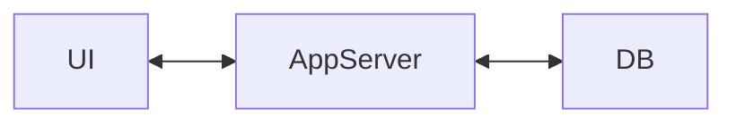
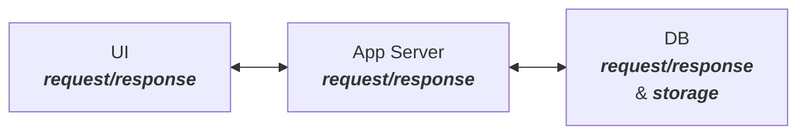
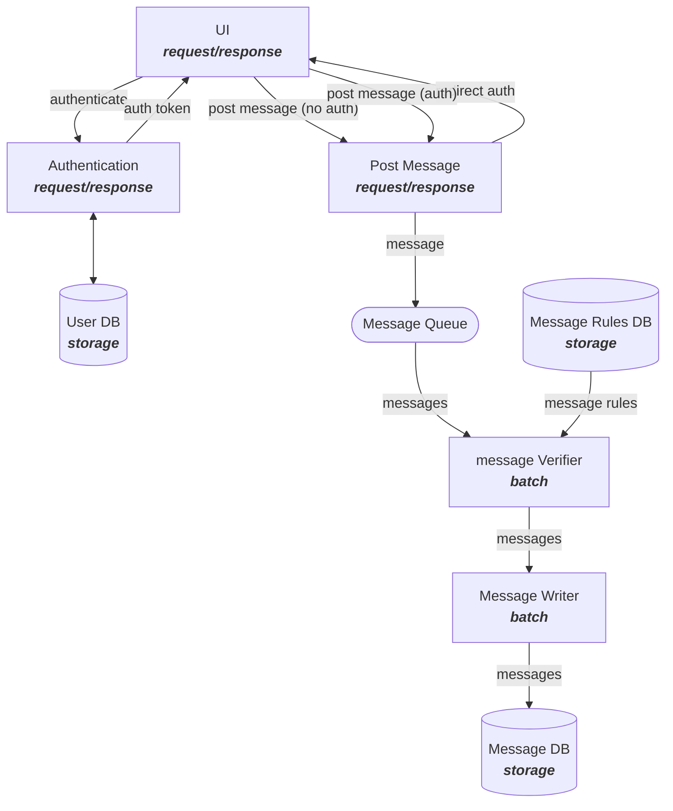
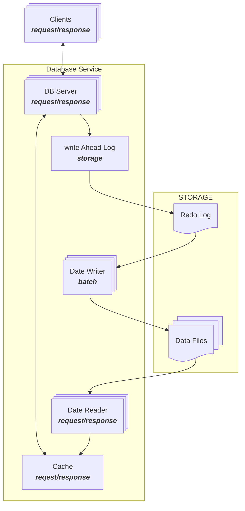
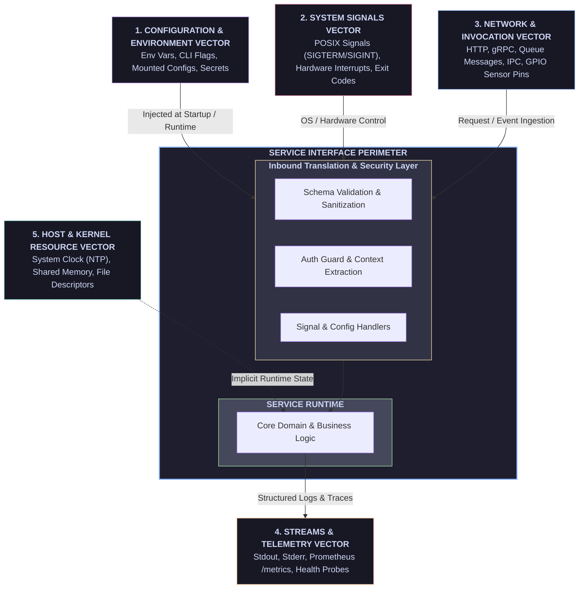
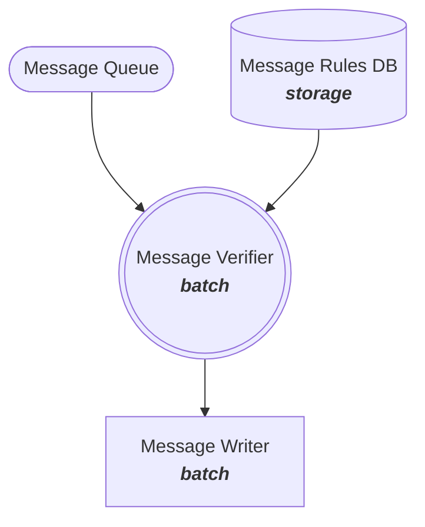
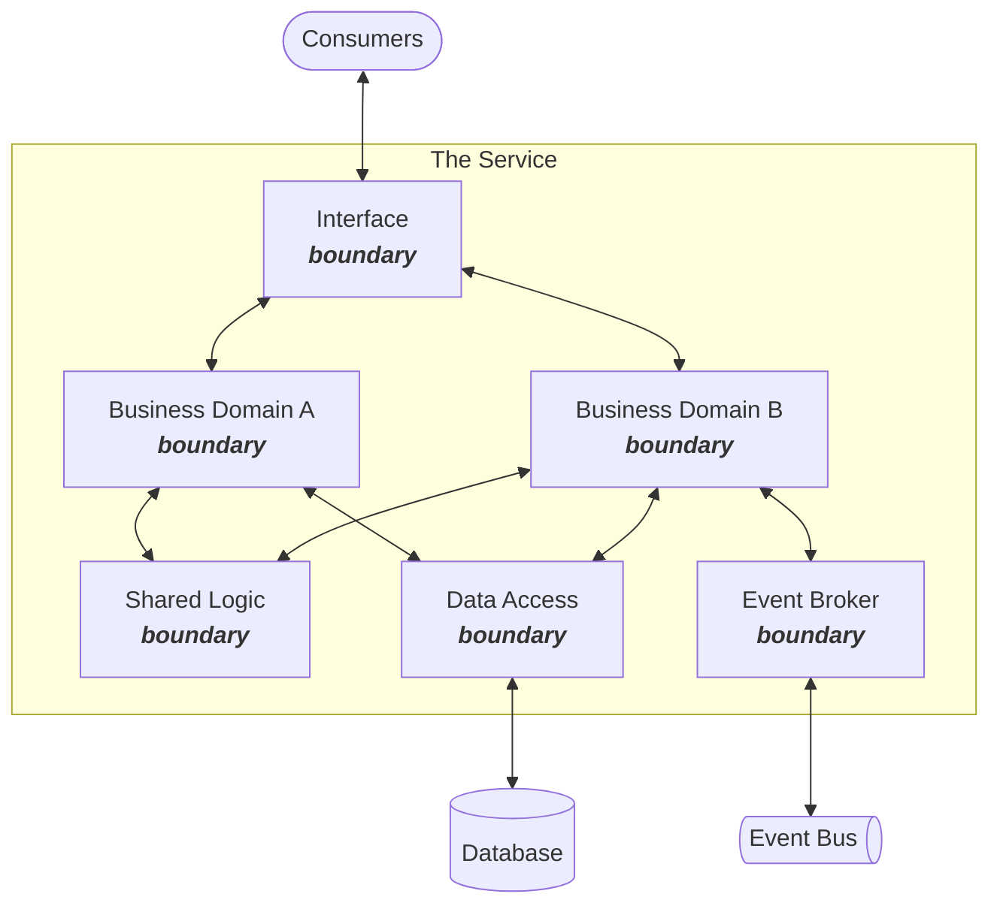

# Defining Services

## Context 
- [Writing Specs](writing-specs.md) - notes on writing specs
- [BDD/TDD and the service boundary model](driving-bdd-tdd-through-the-service-boundary-model.md) - Architecting 100% agent authored services using the service boundary model.

## What A Service Is

In software engineering and automated system design, a **service** is defined as a discrete, autonomous unit of software that performs work, transforms state, or yields outputs on behalf of a caller or environment.

A service is a node in a data flow. E.g. the Classic 3-tier application.

A service is 1 of the 3 service archetypes defined by googles the art of SLOs.
- Request/Response
- Batch
- Storage
### 3-Tier Application

***Note*** - The DB service is a compound service

### N-Tier Application


Conceptually a service can be a composite of services. For example a database sevice.


To build a service, an AI agent needs two completely different sets of knowledge: **What it is writing** (the structural/runtime identity) and **What it needs to do** (the functional logic and NFRs).

The structural identity tells the agent _how to assemble, package, and wire the codebase_. Beyond the core language (e.g., TypeScript) and target artifact (e.g., Docker image running Spring Boot / Node.js), the agent requires a precise manifest covering five key structural dimensions:

### Structural Manifest for Agentic Code Synthesis

#### 1. Runtime & Environment Specs

- **Language & Runtime Version:** e.g., Node.js v20.11 LTS, Java 21 LTS, Python 3.12.
- **Target Container / Base Image:** e.g., `node:20-alpine`, `gcr.io/distroless/java17-debian11`.
- **Build System & Package Manager:** e.g., `pnpm v9.x`, `Gradle v8.5` (Kotlin DSL), `Cargo`.
- **Execution Paradigm:** Long-running HTTP/gRPC server, ephemeral CLI/Cron worker, event consumer, or WebAssembly module.

#### 2. Framework & Architectural Topology

- **Core Frameworks:** e.g., Fastify vs. Express, Spring Boot 3.2 vs. Quarkus, NestJS vs. Hono.
- **Architecture / Directory Pattern:** e.g., Hexagonal/Ports-and-Adapters, Clean Architecture, Vertical Slice, or standard Controller-Service-Repository tree. (How the code should be laid out)
- **Module / Workspace Structure:** Single package repository vs. Monorepo workspace (e.g., Turborepo, Nx) and exact path relative to repo root (`/services/payment-gateway`).

#### 3. Standard Library & Dependency Constraints

- **Approved Dependency Matrix:** Pre-selected libraries for ORMs (Prisma, TypeORM), HTTP clients (Axios, native `fetch`), validation (Zod, Pydantic), and logging (Pino, Winston).
- **Banned / Restricted Packages:** Disallowed dependencies to prevent supply chain risks or bloat (e.g., _"Do NOT use `lodash`; use native ES6 primitives"_).
- **Code Style & Tooling Rules:** ESLint/Prettier configs, TypeScript strictness flags (`strict: true`), or Checkstyle rulesets.

#### 4. Wiring & Infrastructure Abstractions

- **Persistence Layer Drivers:** e.g., PostgreSQL via `pg` driver, Redis via `ioredis`, DynamoDB SDK.
- **Config Management Conventions:** How environment variables are parsed (e.g., `dotenv-cli`, `znv`, or Spring `@ConfigurationProperties`).
- **Observability SDKs:** Standard OpenTelemetry SDK wrappers, Prometheus client libraries, or custom internal logging formatters.

#### 5. Project Scaffold & Test Frameworks

- **Testing Stack:** Unit test runner (Vitest, Jest, JUnit 5), assertion libraries, and mock tooling (MSW, Testcontainers).
- **Build / CI Output Targets:** Compiled output path (e.g., `/dist`, `/target`), Docker build stage targets (`builder` vs. `runner`), and required healthcheck commands (`HEALTHCHECK CMD curl -f http://localhost:8080/healthz`).

## What A Service Has

### Interface
A service **cannot exist without an interface boundary**. The interface boundary represents the formal perimeter surrounding the service runtime. It encompasses every vector through which data, state, execution triggers, control signals, or configuration enter or leave the process. Defining this perimeter explicitly is essential for establishing security boundaries, enabling deterministic testing, and enforcing operational Non-Functional Requirements (NFRs).

#### 2. Why Every Service Must Have an Interface Boundary

Regardless of architecture (microservice, monolith, background daemon, or autonomous IoT device), an interface boundary is structurally non-negotiable for three core reasons:

##### A. Protocol Decoupling and Encapsulation

Without an interface boundary, core business logic becomes directly coupled to runtime transport mechanics. The interface boundary acts as an isolation layer (an "Inbound Adapter") that translates external protocols, raw bytes, or system signals into typed internal domain commands.

##### B. Security, Trust, and Validation Perimeters

External inputs—whether an HTTP payload, a CLI argument, an environment variable, or a physical sensor voltage—are inherently untrusted. The interface boundary is the precise location where input sanitization, schema validation (e.g., Zod, Pydantic, Protobuf), rate limiting, and authentication/authorization checks occur before execution reaches internal domain logic.

##### C. Deterministic Execution and Testability

For a service to be testable (by human engineers or automated AI agents), its execution entry points must be defined and inspectable. The interface boundary provides the deterministic contracts against which mock inputs, synthetic signals, and failing integration test suites can be constructed.

#### 3. Complete Taxonomy of the Service Interface Perimeter

The service interface extends beyond conventional network web endpoints. A complete interface boundary encompasses five distinct vectors:



##### 1. Network & Invocation Vector (Explicit Endpoints)

The primary mechanism for receiving external invocation requests and delivering functional responses.

- **Synchronous Protocols:** REST endpoints (`POST /v1/orders`), gRPC methods, GraphQL resolvers, SOAP calls.
- **Asynchronous / Messaging Handlers:** Message queue consumers (Kafka topics, SQS queues, RabbitMQ channels), Webhook receivers, Server-Sent Events (SSE).
- **Local In-Process / Library Interfaces:** Public exports, language module APIs, C headers, or Unix domain sockets (`/var/run/app.sock`).

##### 2. Configuration & Environment Vector (Startup & Dynamic State)

The vector through which operational contexts and parameters are injected into the service.

- **Environment Variables:** Static deployment configurations (`PORT`, `DATABASE_URL`, `FEATURE_FLAGS`).
- **Command-Line Arguments & Flags:** Execution parameters passed at process invocation (`--dry-run=true`, `--batch-size=500`).
- **Mounted Files & Secrets:** Kubernetes mounted secrets, TLS certificates, dynamic configuration files (`config.yaml`), or remote configuration providers (Consul, AWS AppConfig).

##### 3. System Signals & OS Execution Vector (Control State)

The operational channels through which host systems, orchestrators, or hardware control the service lifecycle.

- **POSIX / Process Signals:** `SIGTERM` (graceful shutdown request), `SIGINT` (interrupt), `SIGHUP` (configuration reload request), `SIGKILL`.
- **Hardware Interrupts & GPIO:** Physical sensor inputs, analog-to-digital converter (ADC) pins, and hardware watchdog timers (critical for edge/IoT autonomous devices).
- **Process Exit Codes:** Returned numeric codes (`0` for success, `1` for general failure, `137` for OOM) communicated back to the host operating system or container orchestrator.

##### 4. Streams, I/O, & Telemetry Vector (Outbound Diagnostics)

The standard channels through which a service projects its internal health, behavior, and log state to external monitors.

- **Standard I/O Streams:** `stdout` (structured JSON application logs) and `stderr` (panic traces and unhandled exceptions) consumed by log aggregators (e.g., Datadog, Fluent Bit).
- **Metrics & Observability Scraping:** Prometheus metric endpoints (`GET /metrics`), OpenTelemetry (OTLP) exporters, and distributed trace headers.
- **Health & Readiness Probes:** Dedicated orchestration checks (`/healthz`, `/readyz`).

##### 5. Host & Kernel Resource Vector (Implicit Dependencies)

The systemic inputs provided by the underlying host environment that influence determinism and state.

- **System Clock / NTP:** The OS clock providing current time inputs for token expiration, schedule intervals, and time-decay calculations.
- **Storage & Inter-Process Communication:** Shared memory segments (`shm`), local disk I/O streams, and operating system kernel calls (`syscalls`).

#### 4. Architectural Summary

|Interface Vector|Primary Inbound/Outbound Artifacts|Primary Failure / NFR Risk|
|---|---|---|
|**Network & Invocation**|Payloads, RPCs, Queue Messages|Schema mismatch, unauthorized access, protocol drops|
|**Config & Environment**|Env Vars, Config Files, Secrets|Missing startup credentials, malformed configuration|
|**System Signals**|`SIGTERM`, `SIGINT`, Exit Codes|Abrupt process termination, state corruption during shutdown|
|**Streams & Telemetry**|`stdout`, `stderr`, `/metrics`|Unobserved crashes, log overflow, missing trace context|
|**Host & Kernel**|System Clock, Shared Memory, File Systems|Clock drift, file descriptor exhaustion, memory leaks|

A robust service architecture must account for **all five vectors** inside its interface boundary spec to ensure complete resilience, security, and testability.


the service must define what it is, and what language it is written in.
E.g. Docker Application server written in Type Script.

### Context
A service has a context. A service's context are the services on which it depends


### Endpoints
A service's endpoints are System level access points to it.

#### ​1. Network & Web Endpoints (Distributed / Remote)

​These operate across network boundaries (TCP/UDP, TLS, HTTP) and require serialization formats like JSON, Protobuf, or XML.

- ​**REST / HTTP APIs:** Resource-based endpoints accessed via standard HTTP verbs (GET /users/123, POST /orders).
- ​**gRPC / RPC:** Method-based remote calls using HTTP/2 and Protobuf binaries for low-latency service-to-service communication (UserService.GetUser()).
- ​**GraphQL:** A single flexible query endpoint (POST /graphql) that dynamically handles flexible data fetching requests in one payload.
- ​**WebSockets / Real-Time:** Full-duplex, persistent connection endpoints (ws:// or wss://) for continuous data streaming (e.g., chat applications, live dashboards).
- ​**SOAP / XML-RPC:** Legacy protocol-bound HTTP endpoints relying on strict XML schemas (common in enterprise banking and legacy systems).

#### ​2. Event & Message Endpoints (Asynchronous / Decoupled)

​These do not involve direct client-server requests; instead, services publish or consume messages via an intermediary broker.

- ​**Message Queue / Pub-Sub Topics:** Consumer/producer endpoints connected to message brokers like Kafka, RabbitMQ, or AWS SNS/SQS (e.g., orders.created.v1).
- ​**Webhooks:** User-defined HTTP callbacks where an external platform pushes HTTP POST payloads to your endpoint when an event occurs (e.g., Stripe payment confirmation).
- ​**Server-Sent Events (SSE):** One-way streaming HTTP endpoints where the server pushes updates continuously down an open HTTP connection to the UI.

#### ​3. Operating System & Process Endpoints (Local / IPC)

​These operate within a single physical machine or operating system, enabling communication between distinct processes or between user applications and the kernel.

- ​**OS / System Calls (Syscalls):** The software boundary where user-space programs request kernel-space hardware operations (e.g., read(), write(), fork()).
- ​**IPC / Unix Domain Sockets:** High-speed, local inter-process communication channels bypassing network stacks entirely (e.g., /var/run/docker.sock).
- ​**Named Pipes / Anonymous Pipes:** Stream-based communication channels connecting the standard output of one process directly to the input of another (e.g., cat access.log | grep 500).
- ​**Command Line (CLI):** Process-level execution endpoints invoked via shells with flags, arguments, and standard streams (stdin, stdout, stderr).

#### ​4. Hardware & Storage Endpoints (I/O)

​These represent boundaries where software interfaces directly with physical devices or kernel subsystems.

- ​**Device Drivers & File Descriptors:** File-system handles representing physical hardware interfaces in Unix systems (e.g., /dev/sda for disk block storage, /dev/tty for terminal input).
- ​**Network Interfaces (NICs):** The physical or virtual network interface cards identified by IP addresses or MAC addresses where network packets enter or leave a host (eth0, lo0).

#### ​Summary Matrix

|Endpoint Category|Boundary Type|Communication Pattern|Key Examples|
|---|---|---|---|
|**Network & Web**|Network / Transport Protocol|Synchronous / RPC / Duplex|REST (`GET /v1/users`), gRPC (`UserService.GetUser`), GraphQL (`POST /graphql`), WebSockets (`wss://`), SOAP|
|**Event & Messaging**|Message Broker / Push Callbacks|Asynchronous Pub-Sub / One-Way Stream|Kafka topics (`orders.created`), Webhooks (`POST /stripe/webhook`), Server-Sent Events (SSE), SQS Queues|
|**Process & OS (IPC)**|Local OS Kernel / Memory Boundary|Local Inter-Process / Stream Execution|Unix Domain Sockets (`/var/run/docker.sock`), CLI (`stdout`/`stdin`), Syscalls (`sys_read`), Named Pipes|
|**Hardware & Storage**|Kernel Subsystem / Physical I/O|Low-Level Input & Output|Device Drivers (`/dev/sda`, `/dev/tty`), Network Interface Cards (`eth0`, `lo0`)|


### Boundaries

- [Service Boundary Model](driving-bdd-tdd-through-the-service-boundary-model.md)

There are 2 types of boundary within a service.
* functional boundaries
* cross cutting boundaries.
#### Functional Boundaries
Functional boundaries separate the functions of the service into domains.
There are 4 types of functional boundary 
- Service Interface
- Business Domains
- Shared Logic
- External Dependencies 

The functions on the Functional boundaries define what the service does. 

##### Functions
Not all functions in a service exist on a functional boundary, private functions, functions wholly within the Domain do not. All identified functions **must** have
* A signature 
* A description 

**The Signature**
The function signature is expressed in UML.
`function-name([arg-name: arg-type]*): return-type`

**The Description**
The functions description describes what the function does. The function may be described by
- Prose
- Pseudo-code
- Sequence diagrams 
Or a combination of all 3.
The description of the functions should be sufficient to track the behaviour of the service from interface endpoints to external dependencies. 

#### Cross Cutting Boundaries
- **​Security & Trust Boundary** - Safety & Compliance (NFR): Ensures untrusted input cannot pollute internal domain state and validates permissions before resource consumption starts.
- ​**Resilience / Bulkhead Boundary** - Availability & Fault Tolerance (NFR): Prevents resource starvation (e.g., memory, thread exhaustion) caused by a failing upstream client or slow downstream dependency.
- ​**Concurrency Boundary** - Throughput & Scalability (NFR): Controls thread handoffs, locks, and async queues to maximize multi-core CPU utilization without causing deadlocks or race conditions.
- ​**State / Transaction Boundary** - Consistency & Integrity (NFR): Guarantees data correctness under concurrent writes, hardware failure, or unexpected crash scenarios.

Cross cutting boundaries identify a set of functional boundary functions and define a set of rules which implicitly extend the set of behaviors that the function must exhibit. 

E.g.
- **Functional Behavior Tests (Functional Boundaries):**
    - ​_Example:_ Test that passing a valid OrderPayload to 1.0 yields a 201 Created and updates the DB state.
- ​**Aspect Verification Tests (Cross-Cutting Boundaries / NFRs):**
    - ​_Resilience Test:_ Mock downstream API 2.1 to delay by 2000\text{ms}. Assert that the service aborts at 1500\text{ms} with a 503 Service Unavailable (verifying the resilience boundary).
    - ​_Security Test:_ Invoke 1.1 with an unauthenticated UserContext. Assert that execution halts at the interface boundary with 401 Unauthorized before reaching domain logic.
    - ​_Transaction Test:_ Inject a failure into 2.7.4 during DB commit. Assert that state changes in 2.7.1 were completely rolled back.

#### Deriving Required Behaviors 
Since the function graph is resolvable to a specific function call tree for any input state, (a given business condition) and NFRs are defined as rules applied to sets of functions each business condition exposes through inspection of the call graph and cross cutting boundaries additional cross cutting condition variants 

Business level test conditions are derived from the use cases or other analysis attached to the services endpoints. These conditions can be quasi-mechanically extended with NFR conditions to constrian the agents to deliver fit-for-purpose 100% agent-authored code.

#### Lifecycle
When a function is first identified it is neither part of an interface nor on a boundary. As the design progresses the definition of the functions evolve from a bare slug and brief description to a fully specified function, with its signature and prose/Pseudocode/sequence and its calls/called_by.

The record of a service's functions must allow the function definition to consistently referencable Throughput the services design.

Functions should be recorded in a functional catalog. A flat list of all the boundary functions in the service. Initially this is just a table of slugs with a 1 line description and a link to a placeholder document for the function.. As the design evolves the details in the functions placeholder document are refined with more details.

The functional catalog should include a column for the functions boundary. All functions **must**  be on 1 functional boundary.

Each function on a boundary must be a member of an interface before the design is complete. There is no requirement for all the functions on any boundary to share an interface though in practice this will often be the case. The functional catalog should include a column for the functions interface.

### Data Dictionary 

Each function defines its signature including the data types of its parameters and return value.
Initially the data types of the signature may be just bare words. The design is not complete until all the datatypes on the Functional boundaries are recorded in the data dictionary.

The data dictionary defines the schema for all data that crosses the functional boundaries. I.e. in/out of the the service via its interface boundary, in/out of the service via its depdency boundaries and across its internal domain and shared logic boundaries. 

**QUESTION** - how should we record the security of data in transit and data at rest?

## What A Service Does
The service's interface defines how the service interacts with the system, what environment variables it uses, how it responds to the systems signals etc. It also defines how the services consumers operate the service, i.e. how the services endpoints are exposed to their consumers and what those endpoints are. They must be enumerated to define how they are delivered since a service could provide both REST and gRPC endpoints.

Each endpoint identifies a business operation that can be invoked by an actor, e.g. create order, cancel order. The service performs a deterministic sequence of logical steps in response to the endpoints payload and parameters, potentially interacting with the services dependencies and producing the endpoints outputs.

Each endpoint is expected to accept input payloads of a known data type and parameters of known data types. The permutations of the payload values and parameters combinations define the input conditions under which the endpoint is expected to behave. Analysis of the input payload determines its valid and invalid permutations, and which of these permutations affect the expected behaviour of the service. e.g. orders < £1000 go straight to fulfilment while those >= £1000 need to to have an approved purchase order to be fulfilled. 

### Business Conditions Matrix
There are 3 types of dimension on the business condition matrix.
- payload conditions 
- dependency state conditions 
- parameters conditions. 

**payload conditions** are the permutations of the payload which affect the services behaviour. 
E.g. the order-value dimension has values
- < £1000
- => £1000

**dependency state conditions** are permutations of the relevant dependencies.
E.g. customer-state dimension has values 
- customer does not exist 
- customer exists

Or the product-state dimension has values
- does not exist
- nolonger supported
- nolonger available
- purchasable

**parameter conditions** are the permutations of the parameter values
E.g. the notification-parameter dimension has values
- not given
- valid email address 
- invalid email address

Each condition dimension has a discrete set of values. These dimensions form a matrix where each cell in the matrix is a concrete combination of dimension values. Each cell can be assigned a deterministic id in an N.M.0 dotted decimal pattern by giving each dimension a rank and assigning a numerical id to each dimension value. The conditions id is <rank-1-value>.<rank-2-value>.<rank-3-value> etc. Thus the defined condition is the rank-1 condition & the rank-2 condition & the rank-3 condition. 

The expected behaviour of the service must be defined for each cell in the business condition matrix.

The number of cells in the business conditions matrix can become vary large, though in practice some combinations of dimensions and values are mutually exclusive. This especially true with parameter combinations. The invalidity of parameter combinations must be identified through the documentation of the service. Invalid parameter combinations effectively close the interface. Their behaviours are identical, invalid request.

The valid/invalid parameter combinations should be recorded as a yaml. E.g.

```yaml
# ==============================================================================
# API Parameter Interdependency Specification
# Schema Version: 1.0.0
# ==============================================================================
version: "1.0"
service: PaymentGateway
endpoint: POST /v1/charges

# ------------------------------------------------------------------------------
# 1. PARAMETER NODE TREE (Structural Hierarchy & Presence Dependencies)
# ------------------------------------------------------------------------------
# Parent-child nodes inherently define existence dependencies:
# A child node CANNOT exist unless its parent is present/active.
nodes:
  payment_method:
    type: enum
    required: true
    values: [credit_card, paypal, crypto]

  # Node branches tied to payment_method values
  card_details:
    type: object
    parent: payment_method.credit_card # Only exists if payment_method == credit_card
    children:
      card_number:
        type: string
        required: true
      cvc:
        type: string
        required: true
      billing_zip:
        type: string
        required: false

  paypal_details:
    type: object
    parent: payment_method.paypal
    children:
      payer_id:
        type: string
        required: true

  # Operational Parameters
  capture_mode:
    type: enum
    required: true
    values: [automatic, manual]

  amount:
    type: integer
    required: true
    min: 1
    max: 1000000

  currency:
    type: enum
    required: true
    values: [USD, EUR, GBP, BTC]

# ------------------------------------------------------------------------------
# 2. CROSS-NODE CONSTRAINTS (Inter-branch Dependencies & Logic Rules)
# ------------------------------------------------------------------------------
# Explicit predicate rules for cross-cutting business constraints.
rules:
  - id: RULE-001
    description: "Crypto payments must be in BTC currency"
    if:
      payment_method: crypto
    then:
      currency: BTC

  - id: RULE-002
    description: "Crypto payments do not support manual capture mode"
    if:
      payment_method: crypto
    then_forbidden:
      capture_mode: manual

  - id: RULE-003
    description: "High-value transactions (> $10k) require automatic capture"
    if:
      amount: { gte: 10000 }
    then:
      capture_mode: automatic

  - id: RULE-004
    description: "BTC currency is strictly forbidden for card/paypal payments"
    if:
      payment_method: { in: [credit_card, paypal] }
    then_forbidden:
      currency: BTC

```

Conforms to the following TypeScript interfaces
```typescript
export type ParameterType = 'string' | 'integer' | 'boolean' | 'enum' | 'object';

export type ComparisonOperator = {
  eq?: string | number | boolean;
  neq?: string | number | boolean;
  in?: (string | number)[];
  gt?: number;
  gte?: number;
  lt?: number;
  lte?: number;
};

export type ConditionValue = string | number | boolean | ComparisonOperator;
export type ConditionMap = Record<string, ConditionValue>;

export interface ParameterNode {
  type: ParameterType;
  required?: boolean;
  parent?: string; // e.g., 'payment_method.credit_card'
  values?: string[];
  min?: number;
  max?: number;
  children?: Record<string, ParameterNode>;
}

export interface Rule {
  id: string;
  description?: string;
  if: ConditionMap;
  then?: ConditionMap;
  then_forbidden?: ConditionMap;
}

export interface ApiParamDctSpec {
  version: string;
  service: string;
  endpoint: string;
  nodes: Record<string, ParameterNode>;
  rules: Rule[];
}

```
The parameters so defined can be systematically parsed to identify the invalid combinations using the AST parser below
```typescript
import { init, Context, Expr, Solver } from 'z3-solver';
import * as yaml from 'js-yaml';

// ==============================================================================
// 1. AST Type Definitions
// ==============================================================================

export type ParameterType = 'string' | 'integer' | 'boolean' | 'enum' | 'object';

export interface ComparisonOperator {
  eq?: string | number | boolean;
  neq?: string | number | boolean;
  in?: (string | number)[];
  gt?: number;
  gte?: number;
  lt?: number;
  lte?: number;
}

export type ConditionValue = string | number | boolean | ComparisonOperator;
export type ConditionMap = Record<string, ConditionValue>;

export interface ParameterNode {
  type: ParameterType;
  required?: boolean;
  parent?: string; // e.g. "payment_method.credit_card"
  values?: string[];
  min?: number;
  max?: number;
  children?: Record<string, ParameterNode>;
}

export interface Rule {
  id: string;
  description?: string;
  if: ConditionMap;
  then?: ConditionMap;
  then_forbidden?: ConditionMap;
}

export interface ApiParamDctSpec {
  version: string;
  service: string;
  endpoint: string;
  nodes: Record<string, ParameterNode>;
  rules: Rule[];
}

// ==============================================================================
// 2. AST Compiler Class
// ==============================================================================

export class DctZ3Compiler {
  private z3!: Context<'main'>;
  private solver!: Solver<'main'>;
  
  // Track declared Z3 variables and parameter presence booleans
  private vars: Record<string, Expr<'main'>> = {};
  private presenceVars: Record<string, Expr<'main'>> = {};

  /**
   * Main entrypoint: Reads raw YAML string and returns generated invalid payloads.
   */
  public async compileAndFindInvalidPayloads(yamlString: string): Promise<Record<string, string> | null> {
    const { Context } = await init();
    this.z3 = Context('main');
    this.solver = new this.z3.Solver();

    const spec = yaml.load(yamlString) as ApiParamDctSpec;

    // Phase 1: Declare Z3 variables & presence booleans for all nodes recursively
    this.declareNodes(spec.nodes);

    // Phase 2: Compile parent-child tree hierarchy assertions
    const structuralInvariants = this.compileStructuralInvariants(spec.nodes);

    // Phase 3: Compile cross-node rules (if -> then / then_forbidden)
    const ruleInvariants = this.compileRules(spec.rules);

    // Phase 4: Combine all invariants
    const allInvariants = this.z3.And(...structuralInvariants, ...ruleInvariants);

    // Phase 5: NEGATE the invariants to discover invalid request payloads
    this.solver.add(this.z3.Not(allInvariants));

    // Phase 6: Solve for violating states
    if ((await this.solver.check()) === 'sat') {
      const model = this.solver.model();
      const invalidPayload: Record<string, string> = {};

      for (const [key, expr] of Object.entries(this.vars)) {
        const presence = model.eval(this.presenceVars[key]).toString();
        if (presence === 'true') {
          invalidPayload[key] = model.eval(expr).toString();
        } else {
          invalidPayload[key] = '<ABSENT>';
        }
      }
      return invalidPayload;
    }

    return null;
  }

  // ----------------------------------------------------------------------------
  // Node Variable Declarations
  // ----------------------------------------------------------------------------

  private declareNodes(nodes: Record<string, ParameterNode>, parentPath = '') {
    for (const [nodeName, config] of Object.entries(nodes)) {
      const fullPath = parentPath ? `${parentPath}.${nodeName}` : nodeName;

      // Every parameter node gets a presence indicator boolean
      const presenceVar = this.z3.Bool.const(`${fullPath}__present`);
      this.presenceVars[fullPath] = presenceVar;

      if (config.type === 'enum' && config.values) {
        const v = this.z3.String.const(fullPath);
        this.vars[fullPath] = v;
        
        // Value must be one of the enum values if present
        const enumBounds = config.values.map(val => v.eq(this.z3.String.val(val)));
        this.solver.add(this.z3.Implies(presenceVar, this.z3.Or(...enumBounds)));

      } else if (config.type === 'integer') {
        const v = this.z3.Int.const(fullPath);
        this.vars[fullPath] = v;

        if (config.min !== undefined) {
          this.solver.add(this.z3.Implies(presenceVar, v.ge(config.min)));
        }
        if (config.max !== undefined) {
          this.solver.add(this.z3.Implies(presenceVar, v.le(config.max)));
        }

      } else if (config.type === 'string') {
        const v = this.z3.String.const(fullPath);
        this.vars[fullPath] = v;

      } else if (config.type === 'boolean') {
        const v = this.z3.Bool.const(fullPath);
        this.vars[fullPath] = v;
      }

      // Recurse over object children
      if (config.children) {
        this.declareNodes(config.children, fullPath);
      }
    }
  }

  // ----------------------------------------------------------------------------
  // Structural Parent-Child & Required Assertion Compilation
  // ----------------------------------------------------------------------------

  private compileStructuralInvariants(
    nodes: Record<string, ParameterNode>, 
    parentPath = ''
  ): Expr<'main'>[] {
    const assertions: Expr<'main'>[] = [];

    for (const [nodeName, config] of Object.entries(nodes)) {
      const fullPath = parentPath ? `${parentPath}.${nodeName}` : nodeName;
      const presenceVar = this.presenceVars[fullPath];

      // 1. Root required nodes must be present
      if (config.required && !parentPath && !config.parent) {
        assertions.push(presenceVar.eq(this.z3.Bool.val(true)));
      }

      // 2. Parent dependency enforcement (e.g., parent: "payment_method.credit_card")
      if (config.parent) {
        const [parentParam, parentValue] = config.parent.split('.');
        const parentPresence = this.presenceVars[parentParam];
        const parentVar = this.vars[parentParam];

        // Child node present ==> Parent present AND Parent value matches
        const parentCondition = this.z3.And(
          parentPresence,
          (parentVar as any).eq(this.z3.String.val(parentValue))
        );
        assertions.push(this.z3.Implies(presenceVar, parentCondition));

        // Required child under an active parent branch MUST be present
        if (config.required) {
          assertions.push(this.z3.Implies(parentCondition, presenceVar));
        }
      }

      // 3. Recurse into children
      if (config.children) {
        assertions.push(...this.compileStructuralInvariants(config.children, fullPath));
      }
    }

    return assertions;
  }

  // ----------------------------------------------------------------------------
  // Rule Predicate Compilation
  // ----------------------------------------------------------------------------

  private compileRules(rules: Rule[]): Expr<'main'>[] {
    const ruleAssertions: Expr<'main'>[] = [];

    for (const rule of rules) {
      const ifExpr = this.compileConditionMap(rule.if);

      if (rule.then) {
        const thenExpr = this.compileConditionMap(rule.then);
        ruleAssertions.push(this.z3.Implies(ifExpr, thenExpr));
      }

      if (rule.then_forbidden) {
        const forbiddenExpr = this.compileConditionMap(rule.then_forbidden);
        ruleAssertions.push(this.z3.Implies(ifExpr, this.z3.Not(forbiddenExpr)));
      }
    }

    return ruleAssertions;
  }

  private compileConditionMap(map: ConditionMap): Expr<'main'> {
    const exprs: Expr<'main'>[] = [];

    for (const [key, val] of Object.entries(map)) {
      const v = this.vars[key];
      const presence = this.presenceVars[key];

      if (typeof val === 'string') {
        exprs.push(this.z3.And(presence, (v as any).eq(this.z3.String.val(val))));
      } else if (typeof val === 'number') {
        exprs.push(this.z3.And(presence, (v as any).eq(val)));
      } else if (typeof val === 'boolean') {
        exprs.push(this.z3.And(presence, (v as any).eq(val)));
      } else if (typeof val === 'object' && val !== null) {
        // Handle comparison operators ({ gte: 10000 }, { in: ['A', 'B'] })
        const op = val as ComparisonOperator;

        if (op.eq !== undefined) {
          exprs.push(this.z3.And(presence, (v as any).eq(op.eq)));
        }
        if (op.neq !== undefined) {
          exprs.push(this.z3.And(presence, this.z3.Not((v as any).eq(op.neq))));
        }
        if (op.gte !== undefined) {
          exprs.push(this.z3.And(presence, (v as any).ge(op.gte)));
        }
        if (op.gt !== undefined) {
          exprs.push(this.z3.And(presence, (v as any).gt(op.gt)));
        }
        if (op.lte !== undefined) {
          exprs.push(this.z3.And(presence, (v as any).le(op.lte)));
        }
        if (op.lt !== undefined) {
          exprs.push(this.z3.And(presence, (v as any).lt(op.lt)));
        }
        if (op.in !== undefined) {
          const inOrList = op.in.map(item =>
            typeof item === 'number'
              ? (v as any).eq(item)
              : (v as any).eq(this.z3.String.val(item))
          );
          exprs.push(this.z3.And(presence, this.z3.Or(...inOrList)));
        }
      }
    }

    return exprs.length === 1 ? exprs[0] : this.z3.And(...exprs);
  }
}

// ==============================================================================
// 3. Execution Example
// ==============================================================================

async function run() {
  const yamlSpec = `
version: "1.0"
service: PaymentGateway
endpoint: POST /v1/charges

nodes:
  payment_method:
    type: enum
    required: true
    values: [credit_card, paypal, crypto]

  card_details:
    type: object
    parent: payment_method.credit_card
    children:
      card_number:
        type: string
        required: true
      cvc:
        type: string
        required: true

  capture_mode:
    type: enum
    required: true
    values: [automatic, manual]

  amount:
    type: integer
    required: true
    min: 1
    max: 1000000

  currency:
    type: enum
    required: true
    values: [USD, EUR, GBP, BTC]

rules:
  - id: RULE-001
    description: "Crypto payments must be in BTC currency"
    if:
      payment_method: crypto
    then:
      currency: BTC

  - id: RULE-002
    description: "Crypto payments do not support manual capture mode"
    if:
      payment_method: crypto
    then_forbidden:
      capture_mode: manual

  - id: RULE-003
    description: "High-value transactions (> $10k) require automatic capture"
    if:
      amount: { gte: 10000 }
    then:
      capture_mode: automatic
`;

  console.log("Compiling AST and solving for invalid request payloads...\n");
  const compiler = new DctZ3Compiler();
  const invalidPayload = await compiler.compileAndFindInvalidPayloads(yamlSpec);

  if (invalidPayload) {
    console.log("Found Invalid Request State (Violates Business Invariants):");
    console.table(invalidPayload);
  } else {
    console.log("No invalid states found. Spec is fully satisfied.");
  }
}

run();

```
Systematic identification of the invalid parameter combinations reduces the cells of the business condition matrix where the behaviors of the service need to be defined.

Each combination of payload conditions and entry state conditions are the starting nodes on the given tree. E.g. for the payload dimensions
- order-size
	- < 1000
	- => 1000
- customer-state
	- not-exists
	- exists
- product-state
	- Not-exists
	- no-longer-supported
	- no-longer-available
	- Purchasable 

**QUESTION** - I think we can start with just the payload dimensions. As the design evolves to identify the external depdency states which affect the services behaviors (once the call tree has been defined and a service's interaction with its dependencies are known)  then the given tree is expanded with the relevant dependency state conditions as noted below

Implies the base given tree.
1. Order-size < 1000
	1. Customer exists
		1. Product not exists
		2. Product no longer supported
		3. Product no longer available
		4. Product Purchasable 
	2. Customer does not exist
		1. Product not exists
		2. Product no longer supported
		3. Product no longer available
		4. Product Purchasable 
2. Order-size >= 1000
	1. Customer exists
		1. Product not exists
		2. Product no longer supported
		3. Product no longer available
		4. Product Purchasable 
	2. Customer does not exist
		1. Product not exists
		2. Product no longer supported
		3. Product no longer available
		4. Product Purchasable 
Similar logic as is defined above to collapse the parameter conditions by removing invalid parameter combinations can be used to systematically collapse branches of the given tree which are invalid. E.g. the customer must exist for the product state to be relevant.

The base given tree collapses to

Order-size < 1000
	1. Customer exists
		1. Product not exists
		2. Product no longer supported
		3. Product no longer available
		4. Product Purchasable 
	2. Customer does not exist
2. Order-size >= 1000
	1. Customer exists
		1. Product not exists
		2. Product no longer supported
		3. Product no longer available
		4. Product Purchasable 
	2. Customer does not exist 

The set of valid parameter combinations implies the 'when set'.
E.g.
- When payment-type = card & card-no = 1234
- when payment-tyoe = crypto & wallet = abcd
- etc

The product of the 'base given tree' and the 'when set' gives the entry conditions that the service must handle. The required effects of the service on its dependencies and its outputs,  payload, return code, stdout and stderr (where relevant) must be defined by the service documentation. 

Fixtures or mocks should be defined for each node in the base given tree and the expected outputs defined for each entry condition using those fixtures.

For each fixture set / entry condition the Functional call tree should be defined.
E.g.
- createOrder(contidtion)
	- validateOrder(order)
		- customerCheck(order.customer)
			- CustomerService.getCustomer(customer.id)
		- productCheck(order.products[0])
			- ProductService.getProduct(product.id)
		- productCheck(order.products[1])
			- ProductService.getProduct(product.id)
	- postOrder(order)
		- OrdersDB.save(order)
		- orderEventTransform(order)
		- EventBroker.postEvent(orederEvent)
Each function in the call tree must be defined with at least a description 

Each function should record the call tree's it is invoked by.

The set of call trees invoking each function can derive the full set of called by and calls for each function. Reconciliation can confirm that if a function claims called by then the caller also declares the inverse calls. The full set set of function --> function and the functions themselves are the services call graph.

The set of call trees for a function collectively describe the behaviour of the function and can be used to evolve the function from bare prose to Pseudocode and sequence diagrams.

Reconciliation allows the entry conditions to be played through the description/Pseudocode/sequences of each function to derive the expected result of the services endpoints to the given entry conditions. This can be compared to the required effects of the endpoint to the same entry conditions. Mismatch implies a design miss so redesign is required.

Whenever the entrypoint's expected results are derived the description of the functions is checksummed and recorded with the expected results so that a recorded expected results can be invalidated if the functions definition changes.

This iterative process evolves the functions from bare prose to Pseudocode/sequence diagrams which collectively exhibit the required results.

Once all the expected results of the endpoint match the required results without needing to adjust any function descriptions or the results being invalidated and not re-evaluated then the core design is complete.

The functions are then assigned their functional boundaries, interface, business domains, shared logic, dependencies.

At this stage a mermaid flowchart diagram should be produced for each endpoint starting from the interface function showing its calls through the services  functionsl boundaries, with each functional boundary being a subgraph titled with the boundary name. No sequencing,  just the call graph starting from the endpoint through the services boundaries for all the entry conditions that the endpoint is expected to support. This diagram should be deterministic from the function definitions themselves.

With the call graph and functional boundaries complete and reconciled to the expected results, each call to an external depdency has been identified for the entry conditions. For each dependency call the possible states for the dependency need to be added to the base given tree and any additional required results defined and the new expected results received through Static analysis of the call tree.

The functions can also be assigned to one or more cross-cutting boundary. The rules for each cross-cutting boundary can the also be added to the given tree to expose the services satisfaction of its NFRs [service boundary model](driving-bdd-tdd-through-the-service-boundary-model.md)

## Observability
Observability is a fundamental requirement of a service. 
The observability requirement of a service (or endpoint) Is evolved by its service archetype. 
The archetype identifies which dimensions of service delivery should be monitored and what the SLI shape should be for each.

The design should record which metrics are emitted by each endpoint and how those metrics are combined into the SLIs for each endpoint. The definition of the SLO that monitors the SLIs is for the product and not a feature of the services design

The emitted metrics become part of the required effects of the endpoint.

