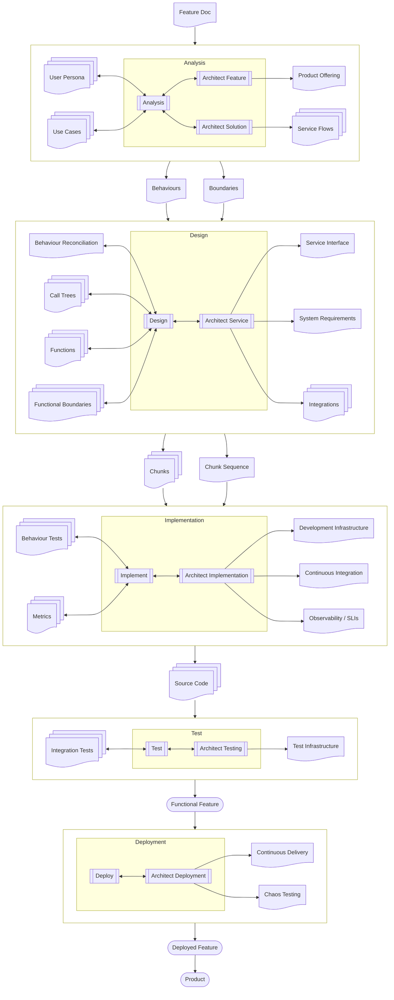

```mermaid
flowchart TD
    classDef layout stroke-width:1px,fill:none
    FEATURE@{shape: doc, label: "Feature Doc"} --> ANAL_LAYOUT
    subgraph ANAL_LAYOUT[" "]
        direction LR
        USER_PERSONAS@{shape: documents, label: "User Persona"} <--> ANALYSIS@{shape: subproc, label: "Analysis"}
        USE_CASES@{shape: documents, label: "Use Cases"} <--> ANALYSIS
        subgraph ANAL["Analysis"]
            direction LR
            ANALYSIS <--> ARCHITECT_FEATURE@{shape: subproc, label: "Architect Feature"}
            ANALYSIS <--> ARCHITECT_SOLUTION@{shape: subproc, label: "Architect Solution"}
        end
        ARCHITECT_FEATURE --> PRODUCT_OFFERING@{shape: doc, label: "Product Offering"}
        ARCHITECT_SOLUTION --> SERVICE_FLOWS@{shape: documents, label: "Service Flows"}
    end
    ANAL_LAYOUT:::layout
    
    ANAL_LAYOUT --> BEHAVIOURS@{shape: doc, label: "Behaviours"} --> DESIGN_LAYOUT
    ANAL_LAYOUT --> BOUNDARIES@{shape: doc, label: "Boundaries"} --> DESIGN_LAYOUT

    subgraph DESIGN_LAYOUT[" "]
        direction LR
        BEHAVIOR_RECONCILIATION@{shape: doc, label: "Behaviour Reconciliation"} <--> DESIGN@{shape: subproc, label: "Design"}
        CALL_TREES@{shape: documents, label: "Call Trees"} <--> DESIGN
        FUNCTIONS@{shape: documents, label: "Functions"} <--> DESIGN
        FUNCTIONAL_BOUNDARIES@{shape: documents, label: "Functional Boundaries"} <--> DESIGN
        subgraph DES[Design]
            direction LR
            DESIGN <--> ARCHITECT_SERVICE@{shape: subproc, label: "Architect Service"}
        end
        ARCHITECT_SERVICE --> SERVICE_INTERFACE@{shape: doc, label: "Service Interface"}
        ARCHITECT_SERVICE --> SYSTEM_REQUIREMENTS@{shape: doc, label: "System Requirements"}
        ARCHITECT_SERVICE --> INTEGRATIONS@{shape: documents, label: "Integrations"}
    end
    DESIGN_LAYOUT:::layout
    
    DESIGN_LAYOUT --> CHUNKS@{shape: documents, label: "Chunks"} --> IMPLEMENT_LAYOUT
    DESIGN_LAYOUT --> CHUNK_SEQUENCE@{shape: doc, label: "Chunk Sequence"} --> IMPLEMENT_LAYOUT
    
    subgraph IMPLEMENT_LAYOUT[" "]
        direction LR
        BEHAVIOUR_TESTS@{shape: documents, label: "Behaviour Tests"} <--> IMPLEMENT@{shape: subproc, label: "Implement"}
        METRICS@{shape: documents, label: "Metrics"} <--> IMPLEMENT
        subgraph IMPL[Implementation]
            direction LR
            IMPLEMENT <--> ARCHITECT_IMPLEMENTATION@{shape: subproc, label: "Architect Implementation"}
        end
        ARCHITECT_IMPLEMENTATION --> DEV_INFRA@{shape: doc, label: "Development Infrastructure"}
        ARCHITECT_IMPLEMENTATION --> CONTINUOUS_INTEGRATION@{shape: doc, label: "Continuous Integration"}
        ARCHITECT_IMPLEMENTATION --> OBSERVABILITY@{shape: doc, label: "Observability / SLIs"}
    end
    IMPLEMENT_LAYOUT:::layout

    IMPLEMENT_LAYOUT --> SOURCE_CODE@{shape: documents, label: "Source Code"} --> TEST_LAYOUT
    
    subgraph TEST_LAYOUT[" "]
        direction LR
        INTEGRATION_TESTS@{shape: documents, label: "Integration Tests"} <--> TEST@{shape: subproc, label: "Test"}
        subgraph TST["Test"]
            direction LR
            TEST <--> ARCHITECT_TEST@{shape: subproc, label: "Architect Testing"}
        end
        ARCHITECT_TEST --> TEST_INFRA@{shape: doc, label: "Test Infrastructure"}
    end
    TEST_LAYOUT:::layout
    
    TEST_LAYOUT --> FUNCTIONAL_FEATURE@{shape: stadium, label: "Functional Feature"} --> DEPLOY_LAYOUT
    
    subgraph DEPLOY_LAYOUT[" "]
        direction LR
        subgraph DEPL["Deployment"]
            direction LR
            DEPLOY@{shape: subproc, label: "Deploy"} <--> ARCHITECT_DEPLOYMENT@{shape: subproc, label: "Architect Deployment"}
        end
        ARCHITECT_DEPLOYMENT --> CONTINUOUS_DELIVERY@{shape: doc, label: "Continuous Delivery"}
        ARCHITECT_DEPLOYMENT --> CHAOS_TESTING@{shape: doc, label: "Chaos Testing"}
    end
    DEPLOY_LAYOUT:::layout
    
    DEPLOY_LAYOUT --> DEPLOYED_FEATURE@{shape: stadium, label: "Deployed Feature"} --> PRODUCT@{shape: stadium, label: "Product"}


```