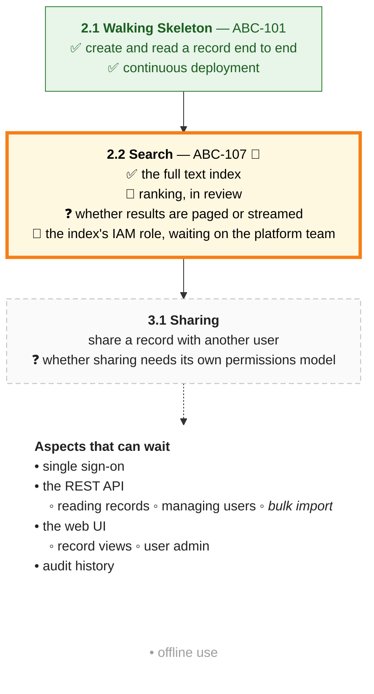
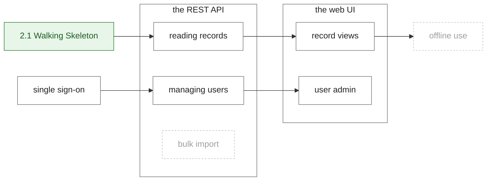

# Roadmaps

## Context
* [Documentation Standards](documentation-standards.md) - the document shape a roadmap follows, and the directory structure it sits beside
* [Product/Service Model](product-service-model.md) - the Product a roadmap is the build plan of
* [dem-docs ROADMAP.md](https://github.com/weaver-engineering/dem-docs/blob/main/ROADMAP.md) - the first roadmap, which this standard is drawn from

A project's **roadmap** says how its product is being built: the slices delivered so far, the slices planned next, and
the aspects of the product that are known and can wait. It is the one place the whole of that can be read without
filling Linear with work that is not yet ready to be done.

## 1 Where It Lives

A roadmap is `ROADMAP.md`, at the root of the project's docs repo, beside `PRODUCT.md`. `PRODUCT.md` links to it
from its Context, and the two stay separate: the product record says what the product is, the roadmap says how it is
getting there. A roadmap that grows satellite documents of its own earns a directory under the directory-per-entity
pattern ([Documentation Standards](documentation-standards.md) §2.1), as any other concept does.

A roadmap is optional. A project with nothing yet to plan has no roadmap, not an empty one.

## 2 Slices

A product is built in **slices**: thin, end-to-end pieces of it, each delivered by a ticket or a few, and verified
end to end. Each slice records two things:

* **Requires** — what had to be defined in the docs before it could be built: the concepts and decisions its tickets
  point their workers at;
* **Delivers** — what it adds to the running product.

A delivered slice also names its tickets, linked to Linear.

**Delivered slices are history, and do not change.** They record what was built and what it rested on at the time;
where the design has moved on since, the design documents say so, not the roadmap.

**Planned slices are aspirations, and do.** They are the current best guess at what comes next, and in what order,
and are rewritten as that changes. What is uncertain about a planned slice is the slice itself — what goes into it,
and when — not the things it names, which are known to be needed. **A planned slice becomes a ticket when it is next,
and not before.**

## 3 Aspects That Can Wait

**Aspects that can wait are not slices.** They are parts of the product that are known — a capability, a decision
still open, a design that will be needed — and that no slice yet depends on. Recording them is what lets them wait
safely; not all of them will ever become a slice of their own, and an aspect is moved into a slice when one takes it
on.

An aspect is either one we are **sure** the product will have, or one we are **not yet sure** is real. Each aspect
points at the design document that records it as undecided, where one does.

**An aspect may have parts.** They are the pieces it decomposes into, each an aspect in its own right, sure or not
yet sure, to any depth.

**An aspect may need others.** What it needs is what must be in place before work on it can start: other aspects,
parts of them, or slices. Needs are a best guess, as planned slices are, and are revised as freely. Decomposing an
aspect is how the work that needs it gets started sooner: what needs only one part of an aspect need not wait for the
rest of it.

## 4 The Where We Are Diagram

A roadmap opens with a diagram of where the product has got to. It shows:

* **a box per slice**, in order, joined by arrows, each listing what the slice delivers or will;
* **delivered slices** in green, each item ticked;
* **the current slice** highlighted, with a runner in its title, and its items marked done, in progress, open
  question or blocked;
* **planned slices** in a faint, dashed box, with dotted arrows leaving them — but with solid text, because what they
  name is known to be needed;
* **the aspects that can wait**, unboxed after the last slice: solid when we are sure of them, faint when we are not;
  an aspect's parts nested beneath it, a part italic when we are less sure of it than of its whole, and the aspects
  left-aligned once any has parts, so that the nesting shows.

**4.a An Example**

✅ done · 🏃 in progress · ❓ open question · 🛑 blocked.

## 5 The Dependency Diagram

Once any aspect needs something, the roadmap carries a second diagram, of what the aspects need: an arrow from each
thing needed to what needs it; each part inside its whole, beside its other parts; a slice in its state's colour, so
that a need already delivered is green. Only aspects that need something, or are needed, are drawn. It sits in the
roadmap's aspects that can wait, not in its opening, because it answers a different question: not where the product
has got to, but what has to happen before a piece of it can start.

**5.a An Example**

The same diagram can be **focused** on one aspect: only what that aspect needs, transitively, with only the parts
actually needed shown inside their wholes, and the aspect outlined. Focused on the web UI, the example drops bulk
import and offline use. A focused diagram is for a conversation or a pull request, not for the roadmap.

## 6 The Roadmap Skill

**The diagrams are never drawn or edited by hand.** It is generated from metadata by the `roadmap` Claude skill, so that
keeping it current is a change of state rather than a redrawing, and so that its format cannot drift. The metadata is
YAML, stored gzipped and base64-encoded in the roadmap's frontmatter under `roadmap`; each diagram sits between its
own two markers in the document.

| Command | Does |
|---|---|
| `extract <roadmap> [<yaml>]` | decompresses the metadata to YAML |
| `apply <roadmap> <yaml>` | validates the YAML, stores it in the frontmatter, and regenerates the diagrams |
| `check <roadmap>` | fails if a diagram is not what the metadata generates |
| `render <yaml>` | prints the diagrams the YAML generates, changing nothing |
| `focus <roadmap> <id>` | prints what one aspect needs (§5), changing nothing |

The metadata lists the slices — each with its section number, title, tickets, state (`delivered`, `current` or
`planned`) and items (`done`, `doing`, `question`, `blocked` or `plain`) — and the aspects, each plain for one we are
sure of or `unsure:` for one we are not, or in a long form that adds an `id`, its `parts` and its `needs`. `apply`
refuses a need that names no aspect or slice, two aspects with one id, an aspect needing itself or its own part or
whole, and needs that form a cycle. Updating a roadmap is: extract the metadata, change it, apply it, bring the
prose into line, and check. The skill's own `SKILL.md` is the full reference.

**The skill is global**, in `~/.claude/skills/roadmap/`, not in any repo. Claude Code finds a project's skills only
from the directory it starts in up to that repository's root, so a skill held above the repositories would not be
found from inside one — and every project's roadmap uses the same skill.

# Rationale

## 1 Why a roadmap is a document, not tickets

Tickets are for work that is ready to be done. Written for work that is not, they bloat the tracker with future
concerns that need housekeeping of their own — re-ranking, rewording, closing what the design has moved past. A
document holds the same knowledge at a fraction of the upkeep, and a planned slice becomes a ticket at the moment it
is next.

## 2 Why delivered slices are immutable

A delivered slice is a fact about what was built and what it rested on. Rewriting it as the design moves would lose
the one thing it records. The design documents hold the current design; the roadmap holds its history.

## 3 Why the diagrams are generated

Redrawn by hand, the diagram costs a careful edit every time anything moves, and each edit is a chance for its format
to drift. Generated, its format is fixed in one place and its upkeep is quasi-mechanical — which also makes it
checkable: whether what is drawn is what the metadata says is a question with a mechanical answer.

## 4 Why dependencies are a second diagram, and aspects have parts

The Where We Are diagram answers where the product has got to; the dependency diagram answers what has to happen
before a piece of it can start. Drawn as one, the second question's arrows would tangle the first's. Parts exist to
shrink that second answer: an aspect that needs all of another waits for all of it, while one that needs a single part
can start as soon as that part is in — and decomposing the aspect needed is what makes the difference visible.
