# Weaver Engineering Workflows

## Context
* [About Weaver Engineering](../about-weaver-engineering.md) - workspace overview
* [Documentation Standards](../standards/documentation-standards.md) - the document shape this follows
* [The Product/Service Model](../standards/product-service-model.md) - Platform/Product/Use Case/Product
  Offering/Service/System/SLO, the continuum the artifacts below sit within
* [Feature Workflow](feature-workflow/feature-workflow.md) - detail for `Analyse Feature`, `Architect Feature`,
  `Architect Solution`, `Design Service`, and `Architect Service`
* [Chunk Cycle](chunk-cycle/chunk-cycle-workflow.md) - detail for `Implement Service` and `Test Service`
* [Feature Testing](feature-workflow/feature-testing.md) - detail for `Test Feature`

A spec is written against a defined functional boundary, not against a Feature or a Product directly — a Feature
justifies *why* the work is worth doing, but the spec itself binds to a boundary that can actually be built and
tested. A Service (deployable) is the common case; a Library (specifiable, but never deployed on its own) is
accommodated by the same model but parked, undeveloped beyond this mention, until it's actually needed (see
[Service §1](../standards/concepts/service.md)).

## 1 Architecture Is A Cross-Cutting Responsibility, Not A Phase

Every phase of the SDLC — Analysis, Design, Implement, Test, Deploy — is paired with its own Architect
responsibility, in continuous two-way interplay rather than a one-shot handoff. Architecture is never a sub-step
performed once inside Analysis or Design; it runs the whole way across, with its own artifacts at every phase.

Analysis pairs with two distinct Architect roles, not one: `Architect Feature` decides how the Feature is actually
offered for consumption (Product Offering), while `Architect Solution` decides the Service topology and data flow
that satisfies it (Service Flows) — naming the functional boundary each use case's operations are actually
specified against. Design, in turn, pairs with a single `Architect Service` role, folding what an earlier version
of this process treated as a separate `Architect Services` step, ahead of Design, into the same
paired-with-a-phase pattern every other phase already follows:

```mermaid
flowchart TD
    classDef layout stroke-width:1px,fill:none
    FEATURE@{shape: doc, label: "Feature Doc"} --> ANAL_LAYOUT
    subgraph ANAL_LAYOUT[" "]
        direction LR
        USER_PERSONAS@{shape: documents, label: "User Persona"} <--> ANALYSIS@{shape: subproc, label: "Analysis"}
        USE_CASES@{shape: documents, label: "Use Cases"} <--> ANALYSIS
        subgraph ANAL["Analysis"]
            direction LR
            ANALYSIS <--> ARCHITECT_FEATURE@{shape: subproc, label: "Architect Feature"}
            ANALYSIS <--> ARCHITECT_SOLUTION@{shape: subproc, label: "Architect Solution"}
        end
        ARCHITECT_FEATURE --> PRODUCT_OFFERING@{shape: doc, label: "Product Offering"}
        ARCHITECT_SOLUTION --> SERVICE_FLOWS@{shape: documents, label: "Service Flows"}
    end
    ANAL_LAYOUT:::layout

    ANAL_LAYOUT --> BEHAVIOURS@{shape: doc, label: "Behaviours"} --> DESIGN_LAYOUT
    ANAL_LAYOUT --> BOUNDARIES@{shape: doc, label: "Boundaries"} --> DESIGN_LAYOUT

    subgraph DESIGN_LAYOUT[" "]
        direction LR
        BEHAVIOR_RECONCILIATION@{shape: doc, label: "Behaviour Reconciliation"} <--> DESIGN@{shape: subproc, label: "Design"}
        CALL_TREES@{shape: documents, label: "Call Trees"} <--> DESIGN
        FUNCTIONS@{shape: documents, label: "Functions"} <--> DESIGN
        FUNCTIONAL_BOUNDARIES@{shape: documents, label: "Functional Boundaries"} <--> DESIGN
        subgraph DES[Design]
            direction LR
            DESIGN <--> ARCHITECT_SERVICE@{shape: subproc, label: "Architect Service"}
        end
        ARCHITECT_SERVICE --> SERVICE_INTERFACE@{shape: doc, label: "Service Interface"}
        ARCHITECT_SERVICE --> SYSTEM_REQUIREMENTS@{shape: doc, label: "System Requirements"}
        ARCHITECT_SERVICE --> INTEGRATIONS@{shape: documents, label: "Integrations"}
    end
    DESIGN_LAYOUT:::layout

    DESIGN_LAYOUT --> CHUNKS@{shape: documents, label: "Chunks"} --> IMPLEMENT_LAYOUT
    DESIGN_LAYOUT --> CHUNK_SEQUENCE@{shape: doc, label: "Chunk Sequence"} --> IMPLEMENT_LAYOUT

    subgraph IMPLEMENT_LAYOUT[" "]
        direction LR
        BEHAVIOUR_TESTS@{shape: documents, label: "Behaviour Tests"} <--> IMPLEMENT@{shape: subproc, label: "Implement"}
        METRICS@{shape: documents, label: "Metrics"} <--> IMPLEMENT
        subgraph IMPL[Implementation]
            direction LR
            IMPLEMENT <--> ARCHITECT_IMPLEMENTATION@{shape: subproc, label: "Architect Implementation"}
        end
        ARCHITECT_IMPLEMENTATION --> DEV_INFRA@{shape: doc, label: "Development Infrastructure"}
        ARCHITECT_IMPLEMENTATION --> CONTINUOUS_INTEGRATION@{shape: doc, label: "Continuous Integration"}
        ARCHITECT_IMPLEMENTATION --> OBSERVABILITY@{shape: doc, label: "Observability / SLIs"}
    end
    IMPLEMENT_LAYOUT:::layout

    IMPLEMENT_LAYOUT --> SOURCE_CODE@{shape: documents, label: "Source Code"} --> TEST_LAYOUT

    subgraph TEST_LAYOUT[" "]
        direction LR
        INTEGRATION_TESTS@{shape: documents, label: "Integration Tests"} <--> TEST@{shape: subproc, label: "Test"}
        subgraph TST["Test"]
            direction LR
            TEST <--> ARCHITECT_TEST@{shape: subproc, label: "Architect Testing"}
        end
        ARCHITECT_TEST --> TEST_INFRA@{shape: doc, label: "Test Infrastructure"}
    end
    TEST_LAYOUT:::layout

    TEST_LAYOUT --> FUNCTIONAL_FEATURE@{shape: stadium, label: "Functional Feature"} --> DEPLOY_LAYOUT

    subgraph DEPLOY_LAYOUT[" "]
        direction LR
        subgraph DEPL["Deployment"]
            direction LR
            DEPLOY@{shape: subproc, label: "Deploy"} <--> ARCHITECT_DEPLOYMENT@{shape: subproc, label: "Architect Deployment"}
        end
        ARCHITECT_DEPLOYMENT --> CONTINUOUS_DELIVERY@{shape: doc, label: "Continuous Delivery"}
        ARCHITECT_DEPLOYMENT --> CHAOS_TESTING@{shape: doc, label: "Chaos Testing"}
    end
    DEPLOY_LAYOUT:::layout

    DEPLOY_LAYOUT --> DEPLOYED_FEATURE@{shape: stadium, label: "Deployed Feature"} --> PRODUCT@{shape: stadium, label: "Product"}
```

Each phase produces its own artifacts; its paired Architect responsibility produces its own, distinct artifacts —
never the same document wearing two hats. Boundaries flow forward, not backward: `Architect Solution`'s Service
Flows name the functional boundary each Service occupies *before* Design starts, alongside the Behaviours Analysis
derives — Design works against an already-named boundary, refining it into the Service's own Functional
Boundaries, rather than discovering the boundary itself as a side effect of designing.

## 2 Neither Analysis Nor Architecture Is Formally Required

A Feature can go straight to Design, and a Service can be designed without ever formally architecting the flow it
participates in. Skipping either doesn't block work — it blocks *reconciliation*, the mechanical check that what's
being built is actually a consumable benefit:

* **Skip Analysis**: Design can still proceed, but nothing can confirm the designed Feature is worth building —
  the decisions Analysis would have made ("is a CLI actually a benefit, and for whom") get made anyway, just
  asserted by whoever's designing rather than derived and checked against an actor's real goal.
* **Skip Architecture**: a Service's own design can still proceed, but nothing can confirm its required
  behaviours actually came from participating in a real service flow rather than the architect simply asserting
  "these are the required behaviours of this Service" with no data-flow justification behind them.

Formally analysing and architecting a Feature is what *enables* reconciliation. Not doing so doesn't prevent
design and implementation of a Feature — it just leaves nothing to mechanically check it against.

## 3 The Three Kinds Of Behaviour

| Kind | Owner | Filed at |
|---|---|---|
| **Required Product Behaviour** | Analysis | `docs/analysis/use-cases/{uc-slug}/behaviors/{operation-slug}.md` |
| **Required Service Behaviour** | Architect (Service) | `docs/services/{slug}/behaviors/{operation-slug}.md` (proposed inside the owning design task first) |
| **Predicted Service Behaviour** | Design | the owning design task's own `reconciliation.yaml` |

A Required Product Behaviour is cumulative and mechanically/LLM-derived from the use case, not independently
authored: step *N*'s Given is the use case's own entry conditions plus every prior step's own Then. The derivation
records a checksum of the use case content it read — falsifiable the same way every other reconciliation in this
process already is, and a real test of whether the use case itself was written with enough detail: a derivation
that has to invent missing detail is the signal that the use case needs more, not a license to invent it here.

A Required Service Behaviour is what a Service is required to do, derived from architecting the design — both
behaviours a use case's own operation touches directly, and ones purely internal to the chosen flow that no use
case ever sees (a multiplayer leaderboard's score-collation pipeline, say). A Predicted Service Behaviour is
Design's own, separate claim about what its chosen components and functions will actually produce. Required and
Predicted are always independent artifacts, on purpose — see §4.

//TODO (WVR-180) — a Required Product Behaviour can also be derived directly from a Feature's own capability,
independent of any use case; see [Analysing A Feature §4](feature-workflow/analysing-a-feature.md). Reconciling
that route into this section, and into Required Behaviors' own mechanics, is still open.

See [Feature Workflow](feature-workflow/feature-workflow.md) and [Design Feature
Instructions](feature-workflow/design-feature-instructions.md) for how each is actually built.

## 4 The Two Reconciliations

"The product is implementable and supports its use cases" requires both, each a cheap checksum-based re-check
precisely because Required and Predicted Service Behaviour never collapse into one artifact:

1. **Feature-level.** Do the Required Service Behaviours and the Service Flows connecting them, triggered by the
   use case's own operations, actually combine to produce the Required Product Behaviours? This is also where a
   required Service is found to have no design at all yet, not just an inconsistent one.
2. **Service-level.** Do a Service's own Predicted Service Behaviours actually match its Required Service
   Behaviours?

## 5 Interface Layering

Analysis, Architecture, Design, and Product Offering each make one distinct decision about *an operation's*
interface, never the same one twice — scoped to one operation, not to the whole use case: a single use case's
different operations routinely need different interface kinds (a CLI for one step, a UI for another — an
elicitation dialogue that starts on the command line and hands off to a browser is still one use case, not two).

1. **Analysis** — for each operation, states only which *kind* of interface it requires (UI/CLI/API; an actor may
   be systematic) and what it must be capable of initiating. No technology, no concrete shape, and no claim that
   every operation in the same use case shares it.
2. **Architecture** (`Architect Solution`) — decides what that operation's interface actually *is*, technologically
   (a React/TS SPA; a `pnpm` CLI tool vs. a bash script vs. a compiled binary; REST vs. RPC) — which in turn informs
   how it can be offered. The interface is itself a component of a Service: something has to exist to interface
   with, and that thing has its own components and dependencies.
3. **Design** (`Architect Service`, via Crystallize The Interface) — crystallizes the *concrete* specification: the
   actual CLI name/arguments/outputs, actual UI wireframes, actual API methods and data types, recorded as the
   Service's own Service Interface. This is the first thing Design does for a Service, before any gap analysis on
   its components. A use case's own supporting material may already sketch this ("the actor wants a CLI tool like
   X that does Y and outputs Z") — that's guidance informing Design, never a constraint on it.
4. **Product Offering** — decides how the now-concrete interface is actually delivered for consumption (see
   [Product Offering](../standards/concepts/product-offering.md)). One Offering can expose many use cases; a use
   case's own required interface *kind* is not itself an Offering decision.

## 6 Steps

Analyse Feature, Architect Solution, and Design Service (below) are defined in real detail today. Architect
Feature (Product Offering) and Implement Service onward are placeholder-level — flagged `//TODO` on their own
linked doc — pending the same depth of discussion Architect Solution and Design have already had. See §1's diagram
above for the full cross-phase picture; the table below is its Analyse-Feature-through-Deploy-Offering slice,
sequenced.

`Design Service` (and everything beneath it, down to `Functional Service`) loops once per Service the Service
Flows identify — a Feature commonly fans out into several Services, each independently designed, implemented,
tested, and deployed before `Test Feature` exercises the assembled whole.

| Step | Description | Exit Criteria |
|---|---|---|
| [Analyse Feature](feature-workflow/feature-workflow.md) | Understands a Feature's use case(s) and derives their Required Product Behaviours. | Every use case in scope has a derived, checksummed set of Required Product Behaviours. |
| [Architect Feature](feature-workflow/architect-feature.md) | Decides how the Feature is actually offered for consumption. | //TODO |
| [Architect Solution](feature-workflow/architect-solution.md) | Decides the Service topology and data flow that will satisfy the Feature's use cases, naming the functional boundary each use case is specified against. | Service Flows exist, naming every Service involved and how data moves between them. |
| [Design Service](feature-workflow/design-feature-instructions.md) | Derives, per Service (its own `Architect Service` phase), its own Required Service Behaviours from the Service Flows; crystallizes the Service's own interface; binds those behaviours to real components/functions. | Every Service in the flow has a checksummed set of Required Service Behaviours, each with a matching Predicted Service Behaviour; both reconciliations (§4) pass. |
| [Implement Service](chunk-cycle/chunk-cycle-workflow.md) | //TODO | //TODO |
| [Test Service](chunk-cycle/chunk-cycle-workflow.md) | //TODO | //TODO |
| [Deploy Service](feature-workflow/deploy-service.md) | //TODO | //TODO |
| [Test Feature](feature-workflow/feature-testing.md) | //TODO | //TODO |
| [Deploy Offering](feature-workflow/deploy-offering.md) | //TODO | //TODO |

## 7 Artifacts

| Artifact | Description | Created By |
|---|---|---|
| [Feature Doc](feature-workflow/initial-feature-document.md) | The seed narrative a Feature starts from. | `Start` |
| [Capability](feature-workflow/analysing-a-feature.md) | A logical unit a Feature groups: something a customer can do through the product, independent of any use case. | Analyse Feature |
| [User Persona](feature-workflow/user-personas.md) | A use case's human actor, formalized as a Role, Goals, Frustrations, and a Technical Proficiency. | Analyse Feature |
| [Use Case](feature-workflow/use-cases.md) | An actor's real goal, achieved through one or more operations, each deferring to a Feature's own capability or defined inline. | Analyse Feature |
| [Required Product Behaviour](feature-workflow/required-behaviors.md) | A use case operation's cumulative Given/Required Effect, derived and checksummed. | Analyse Feature |
| [Service Flows](feature-workflow/architect-solution.md) | The Service topology and data flow chosen to satisfy a Feature's use cases — the Boundaries that flow forward into Design (§1). | Architect Solution |
| [Product Offering](../standards/concepts/product-offering.md) | The channel (UI/CLI/API) a Service's interface is actually delivered through. | Architect Feature |
| [Functional Boundaries](feature-workflow/design-feature-instructions.md) | A Service's own interface and the components/dependencies it's built from, once crystallized by Design. | Design Service |
| [Required Service Behaviour](feature-workflow/design-feature-instructions.md) | What a Service is required to do, derived from the Service Flows. | Design Service |
| [Predicted Service Behaviour](feature-workflow/specific-behaviors.md) | What a Service's designed components/functions actually predict, from its own bound pseudocode. | Design Service |
| [Service Interface](feature-workflow/design-feature-instructions.md) | The Service's own concrete interface specification — actual CLI/UI/API shape — crystallized before any gap analysis. | Design Service |
| [System Requirements](feature-workflow/design-feature-instructions.md) | //TODO | Design Service |
| [Integrations](feature-workflow/design-feature-instructions.md) | //TODO | Design Service |
| [Design Docs](feature-workflow/design-directory-and-hld.md) | The design task's own directory: HLD, chunk scope, reconciliation record, and every proposal it's made. | Design Service |
| [Chunks](feature-workflow/specification-document.md) | //TODO | Design Service |
| [Chunk Sequence](feature-workflow/the-chunk-sequence.md) | //TODO | Design Service |
| [Service Tests](chunk-cycle/chunk-cycle-workflow.md) | //TODO | Implement Service |
| [Source Code](chunk-cycle/chunk-cycle-workflow.md) | //TODO | Implement Service |
| [Metrics](chunk-cycle/chunk-cycle-workflow.md) | //TODO | Implement Service |
| [Dev Infra](feature-workflow/architect-implementation.md) | //TODO | Architect (Implement) |
| [Continuous Integration](feature-workflow/architect-implementation.md) | //TODO | Architect (Implement) |
| [Observability](feature-workflow/architect-implementation.md) | //TODO | Architect (Implement) |
| [Test Results](chunk-cycle/chunk-cycle-workflow.md) | //TODO | Test Service |
| [Test Infra](feature-workflow/architect-tests.md) | //TODO | Architect (Test) |
| [Functional Service](feature-workflow/deploy-service.md) | //TODO | Deploy Service |
| [Functional Feature](feature-workflow/feature-testing.md) | //TODO — the Feature-level state once every in-scope Service has passed Feature testing. | Test Feature |
| [Chaos Testing](feature-workflow/architect-deployment.md) | //TODO | Architect (Deploy) |
| [Continuous Delivery](feature-workflow/architect-deployment.md) | //TODO | Architect (Deploy) |
| [Deployed Feature](feature-workflow/deploy-offering.md) | //TODO — the deployed, running instance of the Feature's Product Offering(s). | Deploy Offering |
| [Product](feature-workflow/deploy-offering.md) | //TODO | Deploy |
| [Consumable Service](feature-workflow/deploy-offering.md) | //TODO | Deploy Offering |

## 8 Chunk Cycle

The Chunk Cycle is the mechanical implementation of a design Chunk through the spec/test/build phases supported
by the `gate-checks` and `task-phases` tools implemented by the-loom weaver-engineering project — the detail
behind `Implement Service` and `Test Service` above.

For more detail see [Chunk Cycle](chunk-cycle/chunk-cycle-workflow.md).

# Rationale

**Why Architecture is drawn as a responsibility paired with every phase, rather than a phase of its own.** An
earlier framing treated architecting the solution as a sub-step inside Design (deciding Service topology once,
before binding functions). That broke down as soon as Implement, Test, and Deploy were considered: each of those
phases has its own genuine architectural decisions (dev infrastructure and CI, test infrastructure, chaos testing
and continuous delivery) that are not remotely Design's concern, but are exactly the same *kind* of decision
Design's own Architect pairing makes — deciding the structural facts a phase's own work depends on, in continuous
interplay with that phase rather than a one-shot handoff before it starts. One responsibility, paired identically
with every phase, is what the pattern actually is; carving it out as "a step Design does once" was only ever true
for the one phase that had been thought through so far.

**Why `Architect Services` folded into a single, Design-paired `Architect Service`, rather than staying its own
step ahead of Design.** The same rule above — architecture is paired with a phase, never a phase (or a step
ahead of one) in its own right — was violated by treating `Architect Services` as a distinct step between
`Architect Solution` and `Design Service`. Folding it into `Architect Service`, paired directly with Design the
same way every other phase's Architect responsibility is, makes the pattern actually uniform rather than
uniform-except-for-the-one-part-thought-through-first.

**Why Analysis pairs with two Architect roles (`Architect Feature`, `Architect Solution`) instead of one.** An
earlier version used a single `Architect Feature` name for both deciding the Feature's Product Offering and
deciding its Service topology — two decisions that happen to share the same Architecture-paired-with-Analysis
responsibility but produce unrelated artifacts. Naming the boundary-deciding half `Architect Solution` is what
actually re-centers this workflow on a spec being written against a defined functional boundary (see the intro
above): the boundary is that role's own, sole output, not one of two unrelated things a single step happens to
produce.

**Why Analysis and Architecture are both explicitly optional.** Making either mandatory would contradict how this
whole process already works elsewhere (design-feature-instructions.md §8: this process is iterative, not a rigid
waterfall). Stating outright what's actually lost by skipping them — reconciliation, not the ability to build
anything — is what stops "was Analysis done" from reading as a compliance gate nobody can explain the cost of
skipping.
